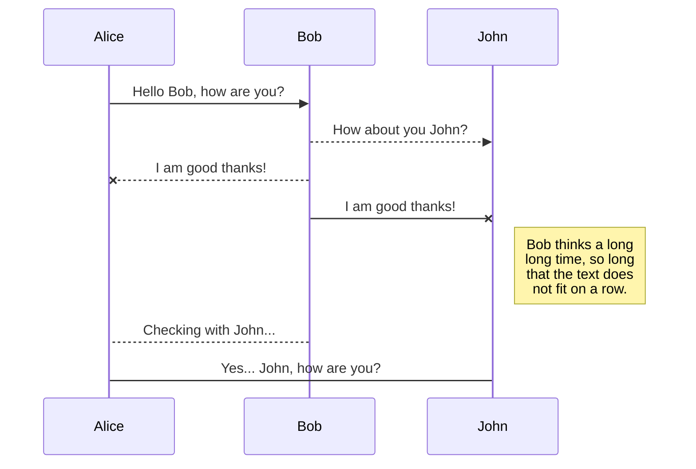
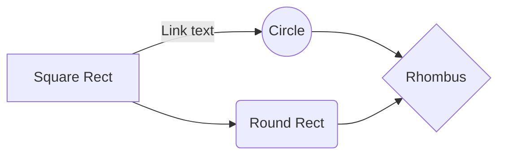

# API - CHAT BOTS

Implement an API for our Bots. This should consist of a HTTP/REST backend and a database.
The backend will have two resources: - /bots: the bot resource represent the bots registered in our
Bot platform. The /bots endpoint have to manage all operations related to bots i.e. create, read,
update and delete.
## POST /bots
### body
```json
{
"id": "36b9f842-ee97-11e8-9443-0242ac120002",
"name": "Aureo"
}
```
### Return codes
>201 = SUCESSO: Bot criado com sucesso
>400 = BAD REQUEST: O body enviado está incorreto
>404 = Rota não encontrada
>500 = ERRO: Serviço está foda do ar

## GET /bots/:id
### JSON de Returno
```json
{
"id": "36b9f842-ee97-11e8-9443-0242ac120002",
"name": "Aureo"
}
```
### Return codes
>200 = SUCESSO: Bot retornado com sucesso
>400 = BAD REQUEST: UUID inválido
>404 = Rota não encontrada
>500 = ERRO: Serviço está foda do ar
## POST /messages
### BODY
```json
{
"conversationId": "7665ada8-3448-4acd-a1b7-d688e68fe9a1",
"timestamp": "2018-11-16T23:30:52.6917722Z",
"from": "36b9f842-ee97-11e8-9443-0242ac120002",
"to": "16edd3b3-3f75-40df-af07-2a3813a79ce9",
"text": "Oi! Como posso te ajudar?"
}
```
### Return codes
>201 = SUCESSO: Mensagem gravada com sucesso
>400 = BAD REQUEST: UUID inválido
>404 = Rota não encontrada
>500 = ERRO: Serviço está foda do ar

## GET /messages/:id
### JSON retorno
```json
{
"id": "16edd3b3-3f75-40df-af07-2a3813a79ce9",
"conversationId": "7665ada8-3448-4acd-a1b7-d688e68fe9a1",
"timestamp": "2018-11-16T23:30:52.6917722Z",
"from": "36b9f842-ee97-11e8-9443-0242ac120002",
"to": "16edd3b3-3f75-40df-af07-2a3813a79ce9",
"text": "Oi! Como posso te ajudar?"
}
```
### Return codes
>200 = SUCESSO: Consulta efetuada  com sucesso
>400 = BAD REQUEST: UUID inválido
>404 = Rota não encontrada
>500 = ERRO: Serviço está foda do ar

## GET /messages?conversationId=:conversationId
### JSON retorno
```json
[
{
"id": "16edd3b3-3f75-40df-af07-2a3813a79ce9",
"conversationId": "7665ada8-3448-4acd-a1b7-d688e68fe9a1",
"timestamp": "2018-11-16T23:30:52.6917722Z",
"from": "36b9f842-ee97-11e8-9443-0242ac120002",
"to": "16edd3b3-3f75-40df-af07-2a3813a79ce9",
"text": "Oi! Como posso te ajudar?"
},
{
"id": "67ade836-ea2e-4992-a7c2-f04b696dc9ff",
"conversationId": "7665ada8-3448-4acd-a1b7-d688e68fe9a1",
"timestamp": "2018-11-16T23:30:57.5926721Z",
"from": "16edd3b3-3f75-40df-af07-2a3813a79ce9",
"to": "36b9f842-ee97-11e8-9443-0242ac120002",
"text": "Gostaria de saber meu saldo?"
}
]
```
### Return codes
>200 = SUCESSO: Consulta efetuada  com sucesso
>400 = BAD REQUEST: UUID inválido
>404 = Rota não encontrada
>500 = ERRO: Serviço está foda do ar
## Instalação Cassandra

Para efetuar a instalação do cassandra acesse o site: https://academy.datastax.com/planet-cassandra/cassandra. Este link possui versão para windows e linux. A dsitribuição usada é da Datastax versão 3.9.0.
**Instruções para instalação:**
Acesse o link abaixo após fazer o download do arquivo.
https://oneideluiz.wordpress.com/2013/10/25/instalando-cassandra-no-windows/

### Criando Keyspace
```sql

CREATE KEYSPACE chat
  WITH REPLICATION = { 
   'class' : 'SimpleStrategy', 
   'replication_factor' : 1 
  };
```

### Criando Tabelas
**Tabela BOTS**
```sql
CREATE TABLE chat.bots (
   id uuid, 
   name text,  
   PRIMARY KEY (id));
```
**Tabela MENSAGENS_POR_ID**
```sql
CREATE TABLE chat.mensagens_por_id(
   id uuid, 
   conversationId uuid, 
   timestampMsg timestamp,
   fromId uuid,
   toId uuid, 
   textMsg text,
   PRIMARY KEY ((id),conversationId));
```

**Tabela MENSAGENS_POR_IDCONVERSA**
```sql
CREATE TABLE chat.mensagens_por_idconversa(
   conversationId uuid, 
   timestampMsg timestamp,
   fromId uuid,
   toId uuid, 
   textMsg text,
   PRIMARY KEY ((conversationId),toId));
```

## UML diagrams

You can render UML diagrams using [Mermaid](https://mermaidjs.github.io/). For example, this will produce a sequence diagram:



And this will produce a flow chart:


